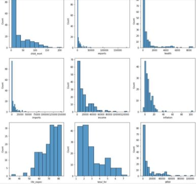
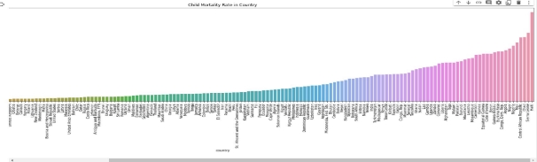
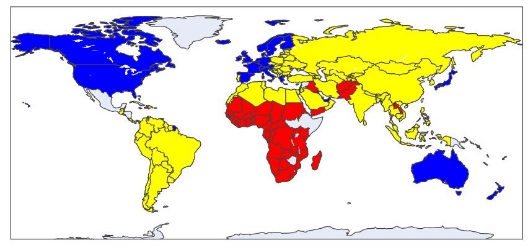
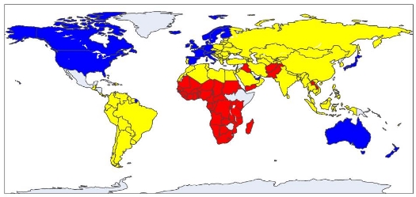
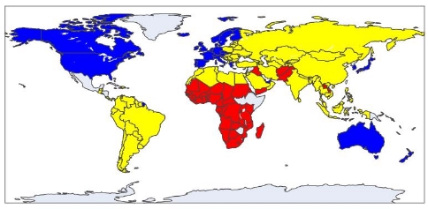
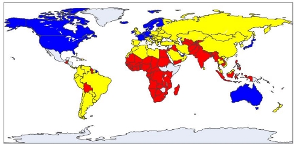
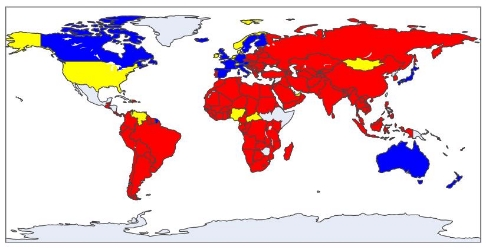
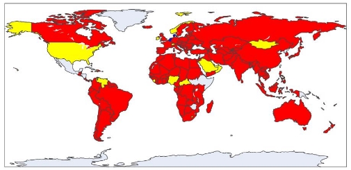

# 🌍 Unsupervised-Learning-on-Country-Data
Built a clustering algorithm to categorise the countries using socio-economic and health factors that determine the overall development of the country. HELP International has been able to raise around $10 million. Now the CEO of the NGO needs to decide how to use this money strategically and effectively. So, the CEO has to make a decision about which countries are in the greatest need of aid. The goal of the project was to apply the principles of machine learning to an existing dataset to effectively suggest the countries on which the CEO needs to focus the most. 
📄 [Documentation](https://arun-raghav-s.github.io/PRML_minor_project) 
👩‍💻 Contributor: [@kashvi0](https://github.com/https://github.com/kashvi0)

###  **Introduction:**

This report gives an overview of the process of building a clustering algorithm to categorise the countries using socio-economic and health factors that determine the overall development of the country. HELP International has been able to raise around $10 million. Now the CEO of the NGO needs to decide how to use this money strategically and effectively. So, the CEO has to make a decision about which countries are in the greatest need of aid. The goal of our project is to apply the principles of machine learning to an existing dataset to effectively suggest the countries on which the CEO needs to focus the most.

Dataset: The file country-data.csv is used as the dataset. The dataset contains 167 rows and 10 columns containing:

- country: name of the country. 167 unique values
- child\_mort: death of children under 5 yr of age per 1000 live births
- exports: exports of goods and services per capita. given as %age of the GDP per capita
- health: total health spending per capita. given as %age of the GDP per capita
- imports: imports of goods and services per capita. given as %age of the GDP per capita
- income: net income per person
- inflation: measurement of the annual growth rate of the total GDP
- life\_expect: the avg number of years a newborn child would live if the current mortality patterns are to remain the same
- total\_fer: the number of children that would be born to each woman if the current age-fertility rates remain the same
- gdpp: the GDP per capita. calculated as the total GDP divided by the total population
###  **Methodology:**

Overview: There are various classification algorithms present, out of which we shall implement the following:

- Kmeans clustering
- Hierarchical clustering
- DBSCAN clustering

We also made use of PCA for parameter estimation and applied all the three above mentioned algorithms with and without PCA.

Exploring the dataset and pre-processing: The descriptive analysis of the data was done, the database was checked for null values, and no missing values were found. The data was checked for categorical values. Except "country," all the features were numerical, with their element data type being either float or integer. Standardisation was done, and PCA was

performed on the standarised data. The distribution of data in each attribute was visually represented. plotted histograms for all the features. Also, a bar plot was created showing all the features for each country. Features were sorted in ascending order before plotting.

life\_expec displays a left skewed data distribution. All the remaining features show a right skewed data distribution.

An example of a bar plot, showing the child\_mort rate in each country. Countries with the lowest

child\_mort are in the range of 2-4 while some countries are in the higher range of 100-200. Implementation of clustering algorithms:

1) Kmeans clustering: It is a method of vector quantization that aims to partition n observations into k clusters in which each observation belongs to the cluster with the nearest mean, serving as a prototype of the cluster. Silhouette score and elbow method were used to determine the optimal value of k.
2) Hierarchical clustering: Used agglomerative clustering, which recursively merges pairs of clusters of sample data; uses linkage distance. Determined the optimal number of clusters using a dendogram.
2) DBSCAN clustering: It stands for density-based spatial clustering. It is able to find arbitrary shaped clusters and clusters with noise. Determined optimal values for epsilon and min\_samples by performing hyperparameter tuning.

### Clustering Algorithms

1. **Kmeans Clustering**
   - With PCA
    
   
   - Without PCA
     
   

2. **Hierarchical Clustering**
   - With PCA
     
   
   - Without PCA
   - 
   

3. **DBSCAN Clustering**
   - With PCA
     
   
   - Without PCA
     
   

We've color-coded the clusters:
- 🔴 "Need Help"
- 🟡 "Might Need Help"
- 🔵 "No Help Needed"

### Evaluation and Results

Here's the Silhouette score comparison:

| Model | With PCA | Without PCA |
|-------|----------|-------------|
| Kmeans | 0.4768 | 0.4219 |
| Hierarchical | 0.4512 | 0.3494 |
| DBSCAN | 0.3533 | 0.3213 |

From the Silhouette scores, Kmeans with PCA emerges as the best clustering algorithm for this dataset.

## 💡 Conclusion

Kmeans with PCA is the preferred choice for clustering countries based on their socio-economic and health factors. This analysis can help HELP International make informed decisions about where to focus their aid efforts.

### Team Members

- 👩‍💻 Kashvi Jain (B21CS037)
- 👨‍💻 Arun Raghav S (B21CS015)
- 👨‍💻 Ashish Meena (B21EE013)
